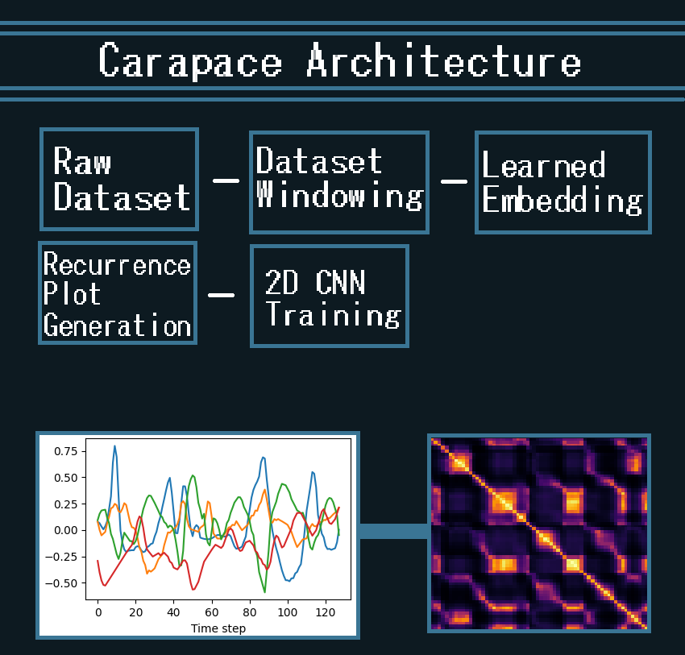
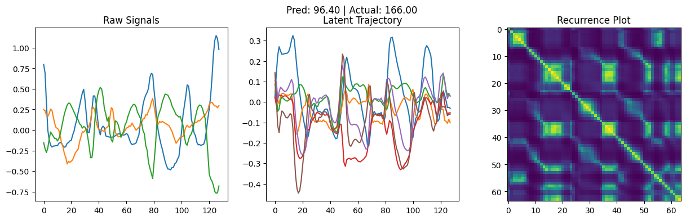
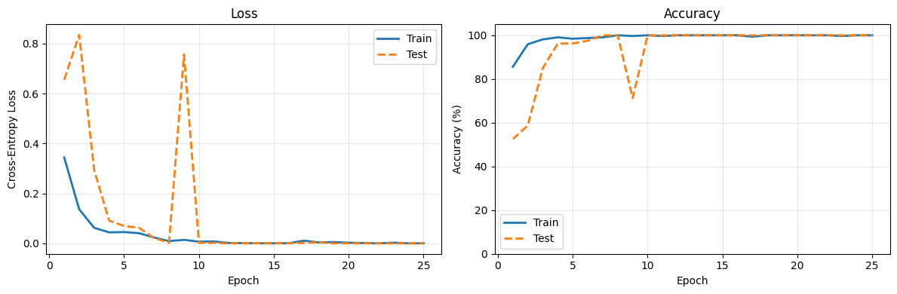
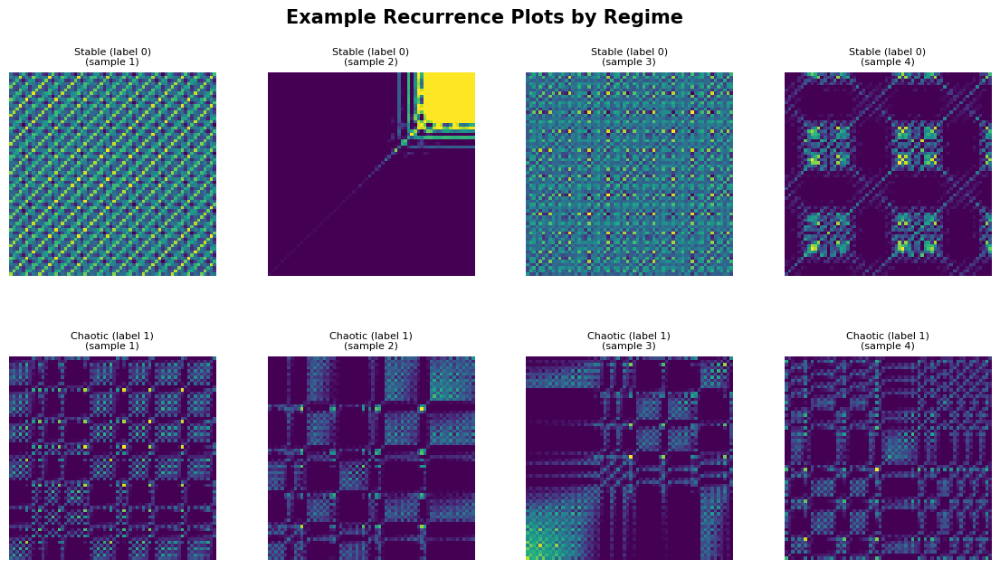
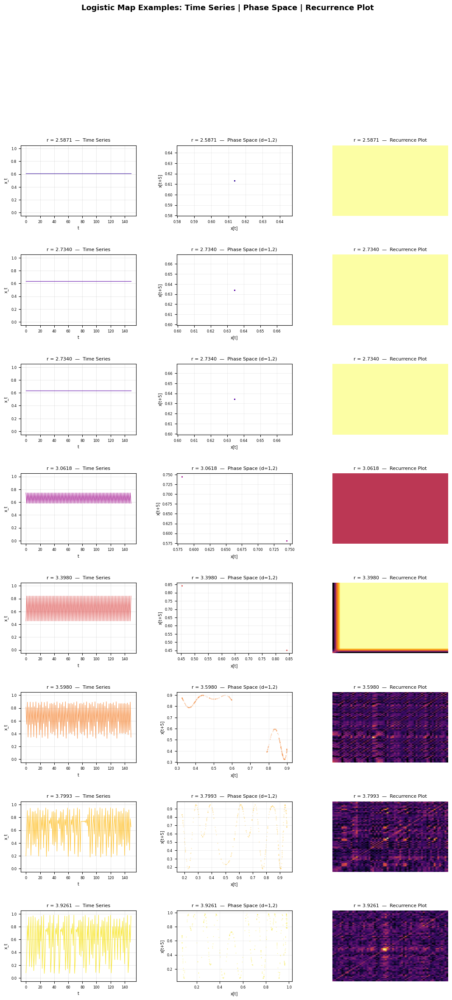
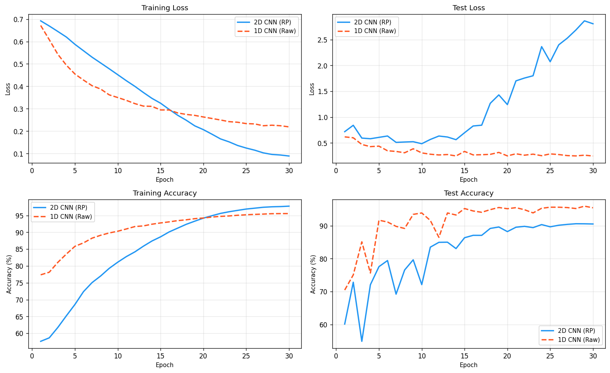
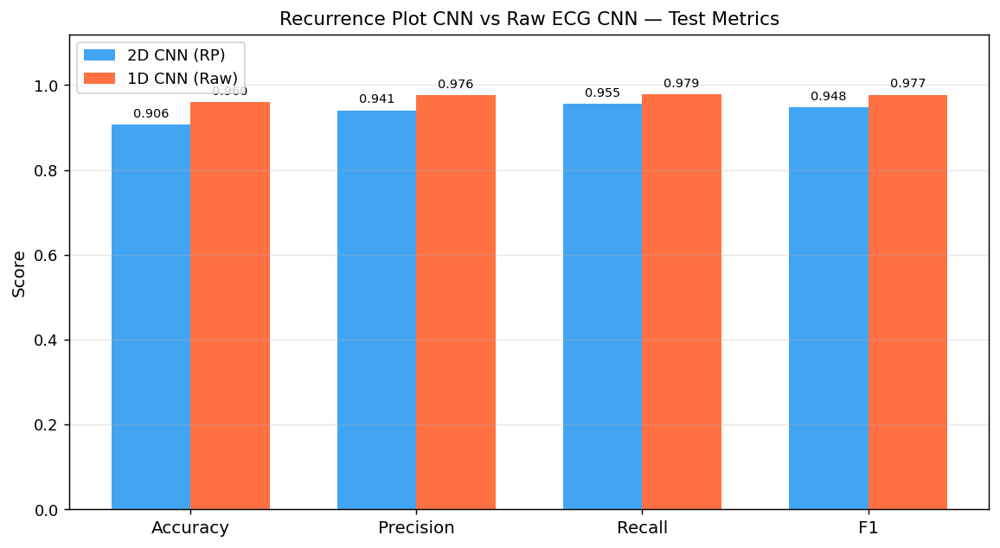
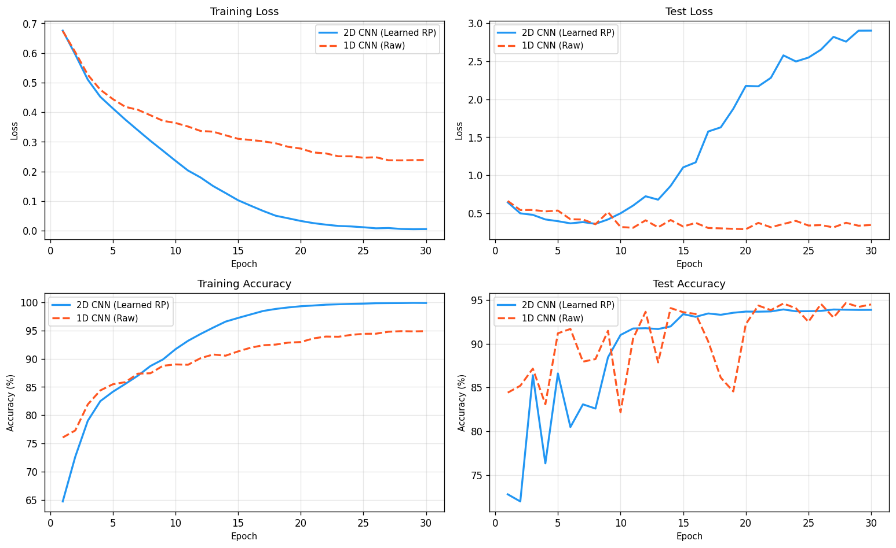
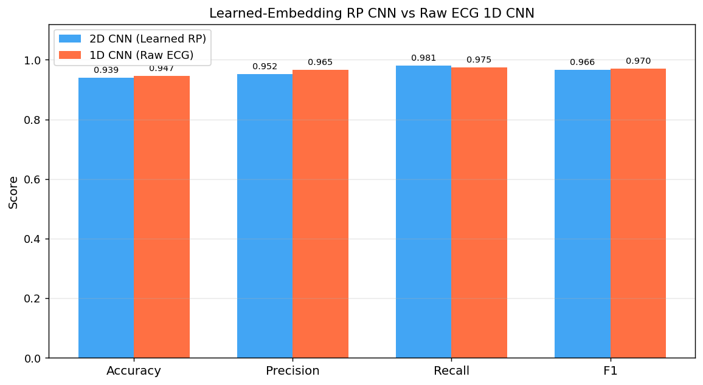

# Carapace: Visualizing data dynamics and geometry with phase space
Carapace is a Machine Learning Architecture which uses phase space embedding and recurrence plots to visualize the dynamics of data.

It works best in high-dimensionality environments where geometry matters more than percise wavelengths, as reccurence plots often lose percission in favor of visualizing general trends and patterns

There are two folders, one containing tests with synthetic data and no baseline, and one with organic data tests in comparison to a baseline model.

## Architecture

The carapace neural network architecture itself is just a convolutional neural network, however the originality of it is in it's data processing. it autosegments data to windows of samples in a time series, training a neural network on those windows to identify the optimal embedding process to phase space. This allows for flexibility across datasets.

It then converts the collection of windows to phase space using the learned embedding method, which creates a latent trajectory graph.

## Development Process
The first idea was to visualize data as a series of fractals, allowing CNNS to deduce meaning from those images. However, eventually it was settled on to instead use phase space projections. The first test was done on classifying stable/chaotic regimes, and after that succeeded, on identifying the vairalbe r in a logistic map.

### Classification Test
After testing it on synthetic data, the model was tested on real world ECG data. It was compared with a base model, being a 1D CNN as opposed to Carapace's 2D CNN. At first it didn't fare very well, until the adaptive learned embedder and windowing techniques were added. After that it was able to surpass the base model in recall.
#### Test 1 Results

#### Test 2 Results

### Regression Test
The primary theory behind the Carapace Architecture is that it improves with dimensionality, so in order to test that theory it was tested on the Beijing PM2.5 Dataset. As with the previous test, Carapace was tested against a 1D CNN base model. At first there were several issues with the learning process (sepcifically returning nan values for MSE and MAE loss), which was fixed by version 2.
#### Test 1 results

